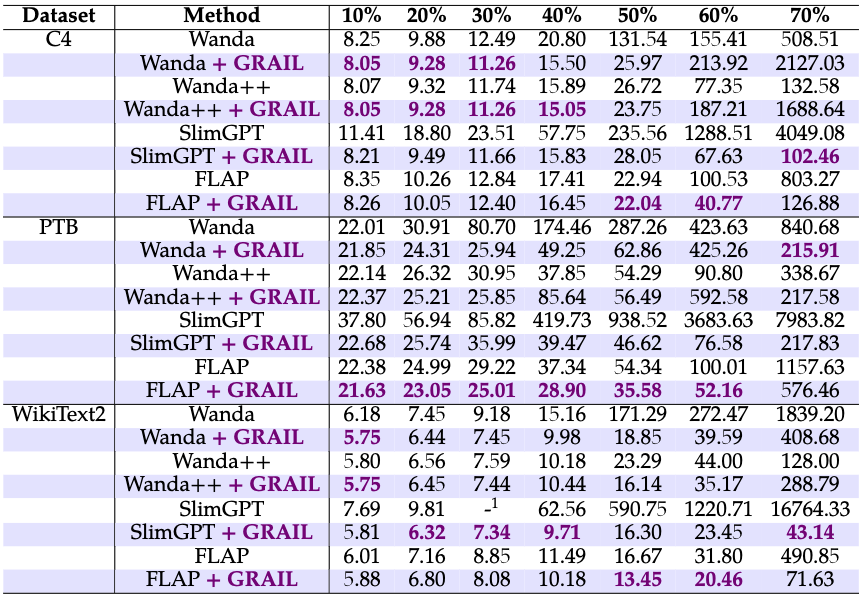

<p align="center">
 <br>
</p>

<div align="center">
<h1>GRAIL</h1>
<h3>GRAIL: Post-hoc Compensation by Linear
Reconstruction for Compressed Networks</h3>
</div>

<p align="center">
    
</p>


## Introduction

**GRAIL** is a post-compression weight compensation framework that significantly recovers the performance of structured compressed Large Language Models (LLMs). By leveraging Gram matrix statistics and ridge regression optimization, GRAIL compensates for information loss caused by structured compression without requiring expensive retraining.

### Key Features

- ✅ **Training-free**: No backpropagation or gradient descent required
- ✅ **Plug-and-play**: Compatible with multiple structured compression methods (FLAP, Wanda-SP, SlimGPT, Wanda++)
- ✅ **Efficient**: Layer-wise compensation, runs in minutes on a single GPU
- ✅ **Effective**: Significant perplexity reduction across different compression ratios
- ✅ **Flexible**: Supports both bias compensation and weight compensation

### Supported Pruning Methods

| Method | Weight Compensation | Bias Compensation |
|--------|:------------------:|:-----------------:|
| FLAP | ✅ | ✅ |
| SlimGPT | ✅ | ✅ |
| Wanda-SP | ✅ | ❌ |
| Wanda++ | ✅ | ❌ |
| Magnitude-SP | ✅ | ❌ |

### Supported Models

- [x] LLaMA (7B, 13B, 30B, 65B)
- [x] LLaMA-2 (7B, 13B, 70B)


## Table of Contents

- [Installation](#installation)
- [Quick Start](#quick-start)
- [Method Overview](#method-overview)
- [Usage](#usage)
- [Configuration](#configuration)
- [Experimental Results](#experimental-results)
- [Zero-shot Evaluation](#zero-shot-evaluation)
- [Citation](#citation)


## Installation

```bash
# Clone the repository
git clone https://github.com/your-repo/GRAIL.git
cd GRAIL

# Install dependencies
pip install torch transformers accelerate datasets

# Optional: For zero-shot evaluation
pip install lm-eval
```

Detailed installation instructions can be found in [INSTALL.md](INSTALL.md).


## Quick Start

### Basic Usage with Weight Compensation

```bash
python main.py \
    --model meta-llama/Llama-2-7b-hf \
    --prune_method flap \
    --pruning_ratio 0.5 \
    --nsamples 128 \
    --dataset wikitext2 \
    --compensate \
    --ridge_lambda 0 \
    --eval
```


## Usage

### Pruning Methods

#### FLAP with GRAIL Compensation
```bash
python main.py \
    --model meta-llama/Llama-2-7b-hf \
    --prune_method flap \
    --pruning_ratio 0.5 \
    --metrics WIFV \
    --structure AL-AM \
    --nsamples 128 \
    --dataset wikitext2 \
    --compensate \
    --ridge_lambda 0 \
    --eval
```

#### Wanda-SP with GRAIL Compensation
```bash
python main.py \
    --model meta-llama/Llama-2-7b-hf \
    --prune_method wanda_sp \
    --pruning_ratio 0.4 \
    --nsamples 128 \
    --dataset wikitext2 \
    --compensate \
    --ridge_lambda 0 \
    --eval
```

#### SlimGPT with GRAIL Compensation
```bash
python main.py \
    --model meta-llama/Llama-2-7b-hf \
    --prune_method slimgpt \
    --pruning_ratio 0.5 \
    --nsamples 128 \
    --dataset wikitext2 \
    --compensate \
    --ridge_lambda 0 \
    --eval
```

#### Wanda++ with GRAIL Compensation
```bash
python main.py \
    --model meta-llama/Llama-2-7b-hf \
    --prune_method wanda_pp_sp \
    --pruning_ratio 0.4 \
    --nsamples 128 \
    --dataset wikitext2 \
    --ro_iter 5 \
    --ro_lr 3e-7 \
    --compensate \
    --ridge_lambda 0 \
    --eval
```


## Configuration

### Core Arguments

| Argument | Type | Default | Description |
|----------|------|---------|-------------|
| `--model` | str | - | HuggingFace model identifier |
| `--prune_method` | str | `flap` | Pruning method: `flap`, `wanda_sp`, `slimgpt`, `wanda_pp_sp`, `mag_sp` |
| `--pruning_ratio` | float | 0.5 | Target pruning ratio (0.0 - 1.0) |
| `--nsamples` | int | 128 | Number of calibration samples |
| `--dataset` | str | `wikitext2` | Calibration dataset: `wikitext2`, `ptb`, `c4` |

### Compensation Arguments

| Argument | Type | Default | Description |
|----------|------|---------|-------------|
| `--compensate` | flag | False | Enable GRAIL weight compensation |
| `--ridge_lambda` | float | 0.001 | Ridge regression regularization (0 = no regularization) |
| `--comp_nsamples` | int | 128 | Number of samples for Gram matrix collection (compensation) |
| `--no_bias_compensation` | flag | False | Disable bias compensation (FLAP/SlimGPT only) |

### Wanda++ Specific Arguments

| Argument | Type | Default | Description |
|----------|------|---------|-------------|
| `--ro_iter` | int | 5 | Regional Optimization iterations |
| `--ro_lr` | float | 3e-7 | Regional Optimization learning rate |
| `--compensate_first` | flag | False | Apply compensation before RO |
| `--alpha` | float | 100 | RGS gradient scaling factor |

### Evaluation Arguments

| Argument | Type | Default | Description |
|----------|------|---------|-------------|
| `--eval` | flag | False | Evaluate perplexity on calibration dataset |
| `--eval_dataset` | str | None | Separate evaluation dataset |
| `--zero_shot` | flag | False | Run zero-shot task evaluation |
| `--eval_batch_size` | int | 16 | Batch size for evaluation |


## Experimental Results

### Language Modeling (Perplexity ↓)

#### LLaMA-2-7B on C4, PTB and WikiText-2

<p align="center">
 <br>
</p>


## Zero-shot Evaluation

Run comprehensive zero-shot evaluation on common benchmarks:

```bash
python main.py \
    --model meta-llama/Llama-2-7b-hf \
    --prune_method flap \
    --pruning_ratio 0.5 \
    --nsamples 128 \
    --dataset wikitext2 \
    --compensate \
    --ridge_lambda 0 \
    --zero_shot \
    --eval_batch_size 16
```

Evaluated tasks:
- **BoolQ**: Boolean question answering
- **PIQA**: Physical reasoning
- **HellaSwag**: Commonsense inference
- **WinoGrande**: Coreference resolution
- **ARC-Easy/Challenge**: Science reasoning


## Project Structure

```
GRAIL/
├── main.py                 # Main entry point
├── lib/
│   ├── prune.py           # Pruning implementations
│   ├── compensation.py    # GRAIL compensation module
│   ├── layerwrapper.py    # Layer wrappers for statistics
│   ├── data.py            # Dataset loading
│   └── eval.py            # Evaluation utilities
├── models/
│   └── hf_llama/          # Modified LLaMA with bias support
├── scripts/               # Experiment scripts
├── batch/                 # SLURM batch scripts
└── figures/               # Results and visualizations
```


## Acknowledgement

- **FLAP**: [Fluctuation-based Adaptive Structured Pruning](https://arxiv.org/abs/2312.11983)
- **Wanda**: [Pruning by Weights and Activations](https://arxiv.org/abs/2306.11695)
- **SlimGPT**: [SlimGPT: Layer-wise Structured Pruning for Large Language Models](https://arxiv.org/abs/2412.18110)
- **lm-evaluation-harness**: [EleutherAI's evaluation framework](https://github.com/EleutherAI/lm-evaluation-harness)


## License

This project is licensed under the Apache License 2.0 - see the [LICENSE](LICENSE) file for details.